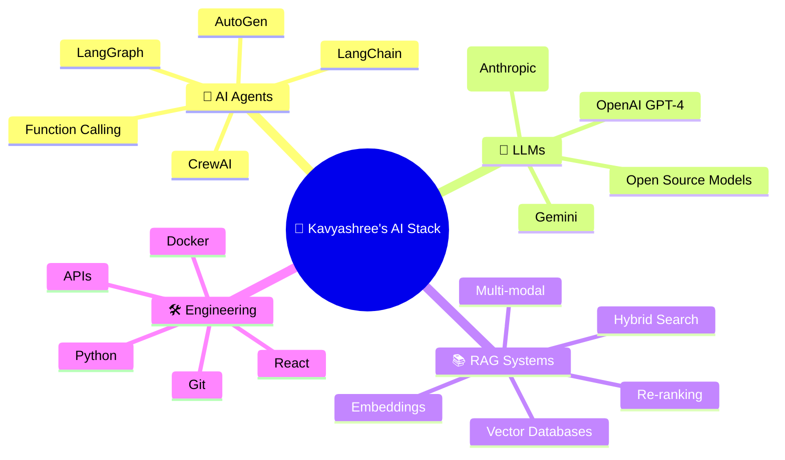

<div align="center">
  
<!-- Animated Header -->


<!-- Typing Animation -->
<a href="https://git.io/typing-svg">
  
</a>

<br/>


<a href="https://github.com/kavyashreer3108?tab=followers"></a>


</div>

<!-- Animated Divider -->


##  About Me

```python
class KavyashreeAI:
    def __init__(self):
        self.name = "Kavyashree"
        self.location = "Bangalore, India 🇮🇳"
        self.role = "Gen AI Engineer & AI Agents Developer"
        
        self.expertise = {
            "AI_Agents": ["LangChain", "CrewAI", "AutoGen", "LangGraph"],
            "LLMs": ["GPT-4", "Claude", "Gemini", "LLaMA", "Mistral"],
            "RAG": ["Vector DBs", "Embeddings", "Hybrid Search", "Re-ranking"],
            "ML": ["Scikit-Learn", "Pandas", "Feature Engineering"],
            "Web": ["React", "JavaScript", "HTML/CSS", "APIs"]
        }
        
        self.current_focus = "Building multi-agent systems that think, plan & execute"
        self.fun_fact = "I talk to LLMs more than humans 🤖"
    
    def say_hi(self):
        print("Thanks for visiting! Let's build something intelligent together 🚀")

me = KavyashreeAI()
me.say_hi()
```

<!-- Animated Divider -->


## 🧬 My AI Universe

<div align="center">



</div>

<!-- Animated Divider -->


## ⚡ Tech Arsenal

<div align="center">

### 🤖 Gen AI & Agents Core


### 🧠 Vector DBs & Embeddings


### 💻 Languages & Frameworks


### ☁️ Cloud


### 🛠️ Tools & Platforms


</div>

<!-- Animated Divider -->


## 🚀 Featured Projects

<div align="center">

<a href="https://github.com/kavyashreer3108/mlproject-student-performance-prediction">
  
</a>
<a href="https://github.com/kavyashreer3108/ReactAIApplication">
  
</a>
<a href="https://github.com/kavyashreer3108/FreshChoiceCart">
  
</a>
<a href="https://github.com/kavyashreer3108/Covidtracker">
  
</a>

</div>

<!-- Animated Divider -->


## 📊 GitHub Analytics

<div align="center">
  
  
</div>

<div align="center">
  
</div>

<br/>

<!-- Activity Graph -->
<div align="center">
  
</div>

<!-- Animated Divider -->


## 🎯 What I'm Up To

<div align="center">

| 🔥 Current | 🌱 Learning | 🎯 Goal |
|:---:|:---:|:---:|
| Building AI Agent Pipelines | LangGraph & Multi-Agent Orchestration | Open Source AI Tools |
| RAG-powered Applications | Advanced Retrieval Strategies | 100 Day AI Challenge |
| LLM Fine-tuning | Agentic Design Patterns | Contributing to LangChain |

</div>

<!-- Animated Divider -->


## 🏆 Achievements & Certifications

<div align="center">


</div>

<!-- Animated Divider -->


## 🤝 Let's Connect & Collaborate

<div align="center">

<a href="https://github.com/kavyashreer3108" target="_blank">
  
</a>
<a href="https://linkedin.com/in/" target="_blank">
  
</a>
<a href="mailto:kavyashreer3108@gmail.com" target="_blank">
  
</a>

</div>

<br/>

<div align="center">
  
</div>

<br/>

<div align="center">
  
  **💡 "I don't just use AI — I build AI that builds things."**
  
  *If you like my work, consider giving a ⭐ to my repos!*

</div>

<!-- Animated Footer -->

